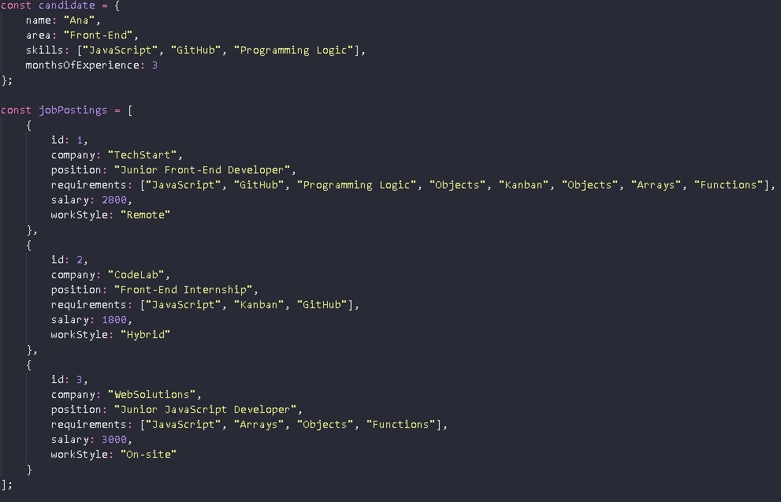
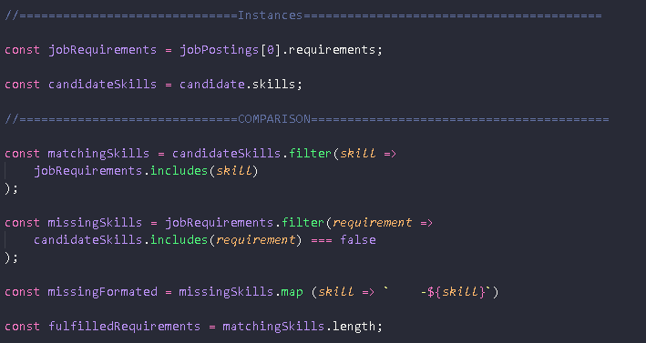
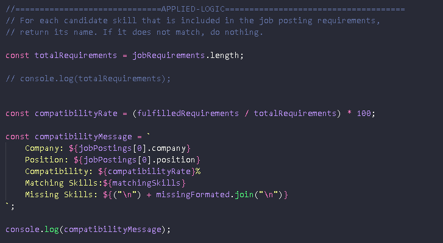
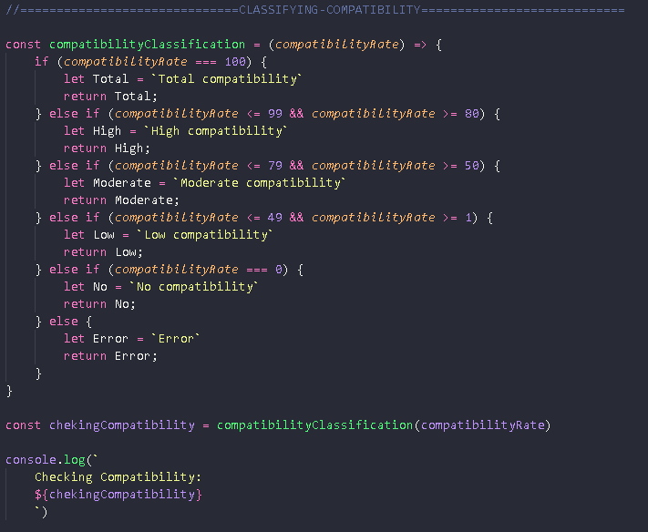

# SkillMatch - Candidate Matching System for Technology Positions

---

## 👨‍💻 Author(s)

* Name: Kauan Kantovick Delfino da Silva
* Area: Front-End Development

---

## 📌 About the Project

The SkillMatch System was developed to solve a challenge faced by a fictional HR department during the recruitment process for technology positions. The department is overwhelmed by the high volume of applications and needs a matching engine to assist in candidate evaluation by assessing their suitability for available job openings.

---

## 🎯 Objective

The system aims to analyze the compatibility level between a candidate and Junior Front-End positions by comparing the candidate's skills with the requirements of registered job openings.

The system analyzes and returns:

✔️ Skills possessed by the candidate
✔️ Skills required by the job position
✔️ Missing skills the candidate needs to meet the requirements
✔️ Compatibility percentage for each job position
❌ Position with the highest compatibility score
❌ Study recommendations for professional growth

---

## 📚 Technologies Used

* JavaScript
* Node.js

---

## ⚙️ How to Run

This project does not require Node.js.

You can run it using one of the following methods:

1. Open the Google Chrome browser.
2. Press **F12** or **Ctrl + Shift + J**.
3. Open the **Console** tab.
4. Copy the code from the `skillmatch.js` file.
5. Paste it into the console.
6. Press **Enter**.

---

## 📸 Screenshots









---

## 🏗️ Project Structure

```text
skillmatch-js/
│
├── skillmatch.js
└── README.md
```

---

## 🔔 Status

* Project under development

---

## 🔗 Links

* GitHub Repository: https://github.com/Kauan-Kantovick/Skillmatch-project.git

* LinkedIn: https://www.linkedin.com/in/kauankantovickdelfino/